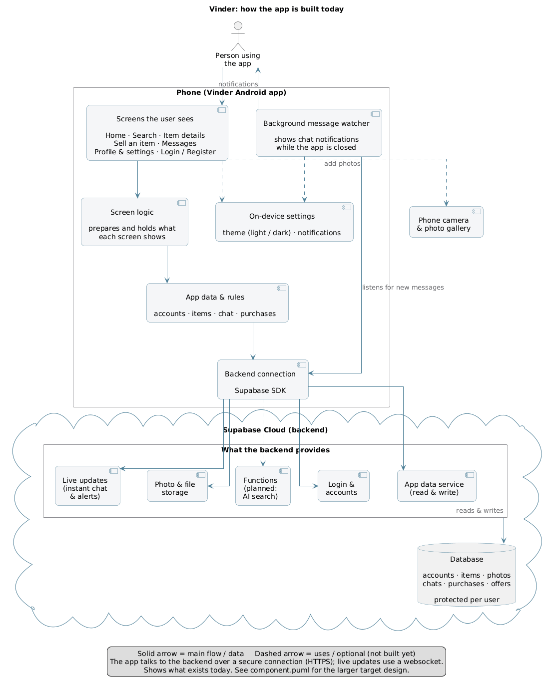
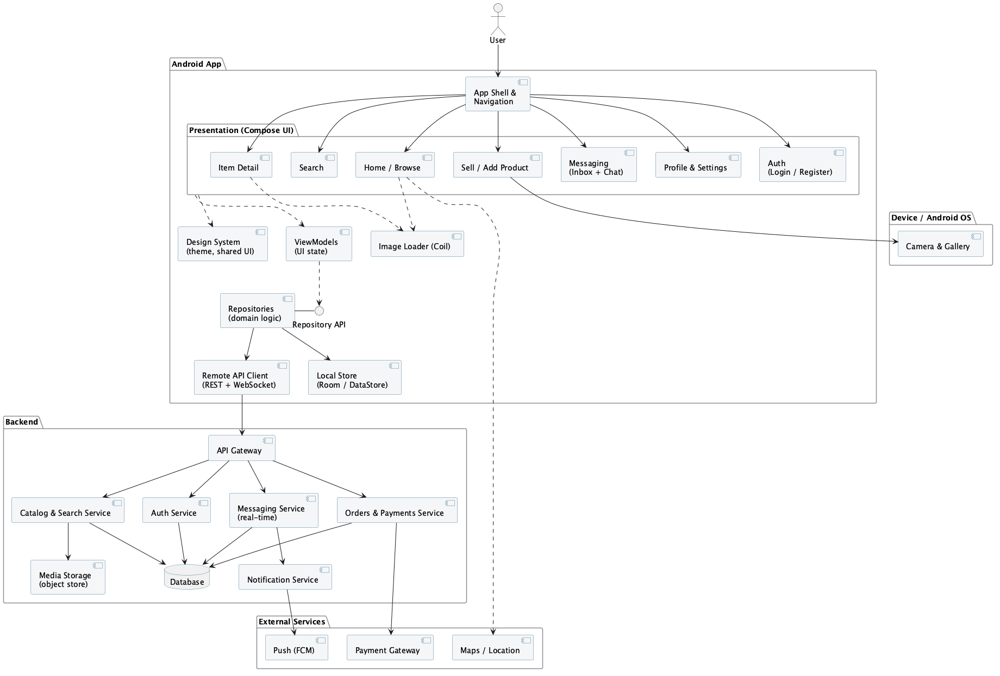
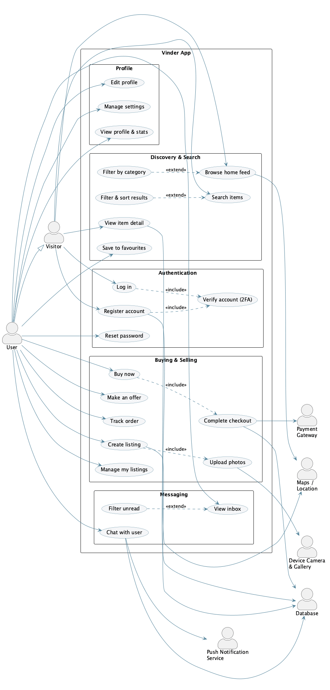
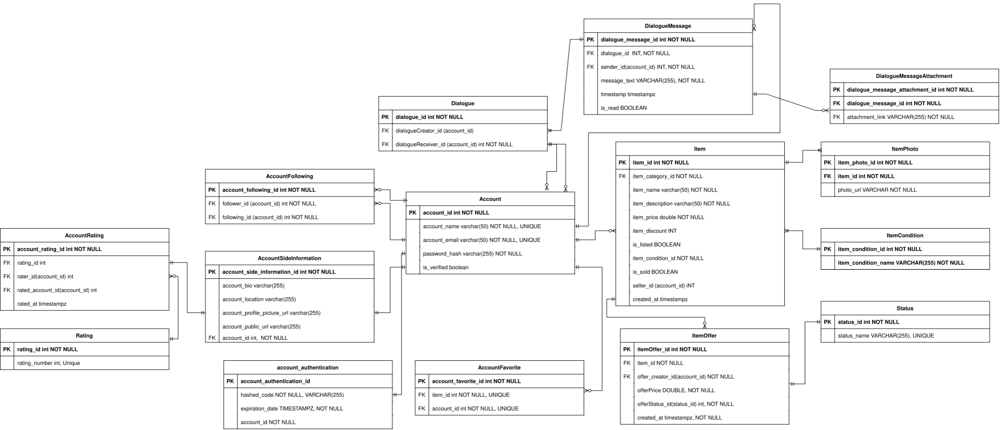

# Vinder: System Design Document

Vinder is a smart and secure marketplace Android application where people can buy, sell,
communicate, and make deals with one another. This document is the technical design of the product:
what it is built from, which libraries and components it uses, and how those parts communicate. It
complements the visual mockups by describing the system behind them.

All diagrams in this document have editable sources under [`docs/diagrams`](diagrams) (PlantUML) and
[`docs/VinderErd.drawio.svg`](VinderErd.drawio.svg) (draw.io). The rendered images are embedded below.

---

## 1. Technology stack and libraries

| Layer | Component / library | Role in Vinder |
|---|---|---|
| Language | Kotlin | Whole application |
| UI | Jetpack Compose (BOM), Material 3 | Declarative screens and theming (light and dark) |
| UI | AndroidX Core SplashScreen | Splash screen on launch |
| Images | Coil 3 | Asynchronous loading of item and profile images from remote URLs |
| State | AndroidX Lifecycle ViewModel, `viewModelScope` | Per-screen state holders, lifecycle-aware coroutines |
| Async | kotlinx.coroutines | Structured concurrency for all suspend work |
| Backend SDK | supabase-kt (BOM): Auth, Postgrest, Realtime, Storage, Functions | Single client that talks to every Supabase service |
| Networking | Ktor (OkHttp engine) | HTTP transport used under supabase-kt |
| Serialization | kotlinx.serialization (JSON) | Maps database rows to and from Kotlin data classes (DTOs) |
| Local storage | Android SharedPreferences | Small on-device settings (account session, notifications, theme) |
| Notifications | Android foreground service + notification channels | Background chat notifications driven by Realtime |
| Testing | JUnit 4, kotlinx-coroutines-test | Unit tests against the repository and ViewModel seams |

The backend is **Supabase Cloud** (a hosted Backend-as-a-Service). Vinder uses these Supabase
components:

| Supabase component | Role in Vinder |
|---|---|
| GoTrue (Auth) | Email and password accounts, email one-time-password reset |
| PostgREST (Data API) | Reading and writing application data over HTTPS |
| Realtime | Live chat messages and notifications over a WebSocket |
| Storage | Item photos, avatars, and chat attachments (object buckets) |
| Edge Functions | Reserved for the planned AI-assisted search |
| PostgreSQL | The database, with Row-Level Security on every table |

---

## 2. System architecture

The as-built architecture is a Jetpack Compose client that talks directly to Supabase Cloud through
the supabase-kt SDK. There is no custom backend server; Supabase provides the backend services.



**Flow of control (top to bottom).** The user interacts with Compose **screens**. Each screen is
backed by a **ViewModel** that holds its state. ViewModels call **repositories**, which contain the
application data and rules. Repositories use the **Supabase client** to reach the backend. On the
Supabase side, the request is served by the matching service (login, data, live updates, storage,
functions) and ultimately reads or writes **PostgreSQL**.

**How the parts communicate.**

- Screen to ViewModel: in-process, via observable state (`StateFlow`).
- ViewModel to repository: in-process, through a repository **interface** (for example
  `IAuthRepository`), which keeps the two loosely coupled and testable.
- Repository to Supabase: over **HTTPS** for auth, data, storage, and functions; over a **WebSocket
  (WSS)** for Realtime chat and notifications.
- Images: Coil loads photos over HTTPS from public Storage URLs.
- Device: the camera and photo gallery are reached through the Android OS when a user adds photos.
- Notifications: a foreground service hosts a Realtime listener so new-message notifications keep
  arriving while the app is in the background.

---

## 3. Component and library view

This diagram shows the internal components and the external libraries they depend on, and how those
dependencies are wired.



The client is organised in layers: presentation (Compose UI and a shared design system), state
(ViewModels), domain (repositories behind interfaces), and data sources (the Supabase client, local
preferences, and the Coil image loader). Cross-cutting concerns such as the theme are shared across
the UI layer. Each repository maps to the Supabase capabilities it needs, which keeps
responsibilities narrow.

---

## 4. Use cases

The main actors and what they can do.



A registered user can browse and search listings, view an item and its seller, add items to a
wishlist, make and manage offers, buy an item, sell their own items (including uploading photos),
and chat in real time with other users. Authentication (register, log in, reset password) gates the
actions that require an account.

---

## 5. Data model

The database is a normalised PostgreSQL schema. Every table has Row-Level Security enabled, so a
signed-in user can only read and write the rows they are allowed to.



**Core entities and relationships.**

- **account** is the central entity. It has a one-to-one **account_side_information** record (bio,
  location, profile picture) and can own many **item** rows as a seller.
- **item** belongs to one **item_category** and one **item_condition**, and has many
  **item_photo** rows.
- **account_favorite** is the wishlist: a many-to-many link between **account** and **item**.
- **item_offer** records a buyer's offer on an item; it references the offering **account** and an
  offer **status**.
- **dialogue** is a chat thread between two accounts (creator and receiver). It has many
  **dialogue_message** rows, and a message can have **dialogue_message_attachment** rows.
- **purchase** records a completed sale: the **item**, the buyer and seller accounts, and the price
  breakdown (item price, shipping fee, protection fee, total).
- **account_following** links accounts to each other (follower and following). **rating** and
  **account_rating** let accounts rate one another.

---

## 6. Security

- **Authentication** is handled by Supabase GoTrue (email and password), with email one-time-password
  for password reset. The app never stores raw passwords.
- **Authorization** is enforced in the database with **Row-Level Security** on every table, so access
  rules are applied server-side and cannot be bypassed by the client. Storage uploads are scoped by
  path so a user can only write under their own item, avatar, or dialogue prefix.
- **Secrets** (the Supabase URL and anonymous key) are injected at build time from a git-ignored
  `local.properties`; no secrets are committed.
- **Transport** is HTTPS for requests and WSS for Realtime.

---

## 7. Summary: how the components communicate

Reading the layers end to end: a Compose screen observes state from its ViewModel; the ViewModel
calls a repository through an interface; the repository uses the supabase-kt client to reach the
right Supabase service over HTTPS or a WebSocket; that service reads or writes PostgreSQL under
Row-Level Security; and the result flows back up as typed Kotlin objects that update the screen. This
separation (UI, state, domain, data) keeps components loosely coupled, individually testable, and
straightforward to extend.

---

### Rendering the diagrams

PlantUML sources live in [`docs/diagrams`](diagrams). To re-render after editing:

```bash
brew install plantuml graphviz
plantuml -tpng -tsvg docs/diagrams/*.puml
```

The entity relationship diagram is edited with [draw.io](https://app.diagrams.net) and stored as an
editable SVG at [`docs/VinderErd.drawio.svg`](VinderErd.drawio.svg).
